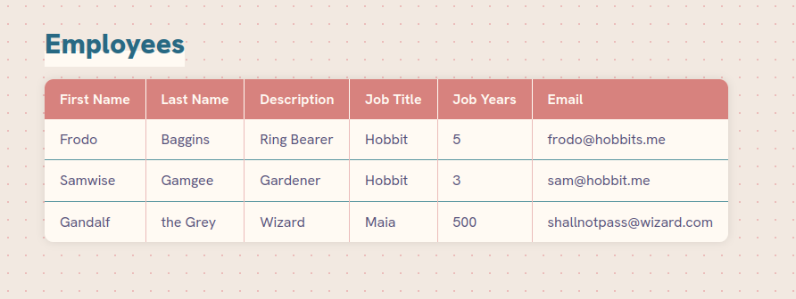
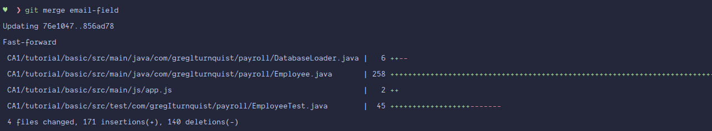
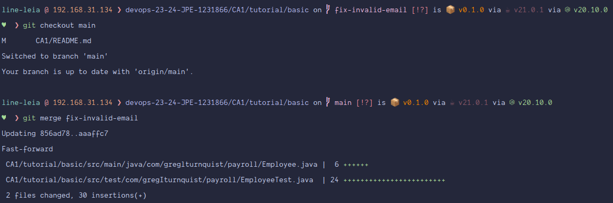
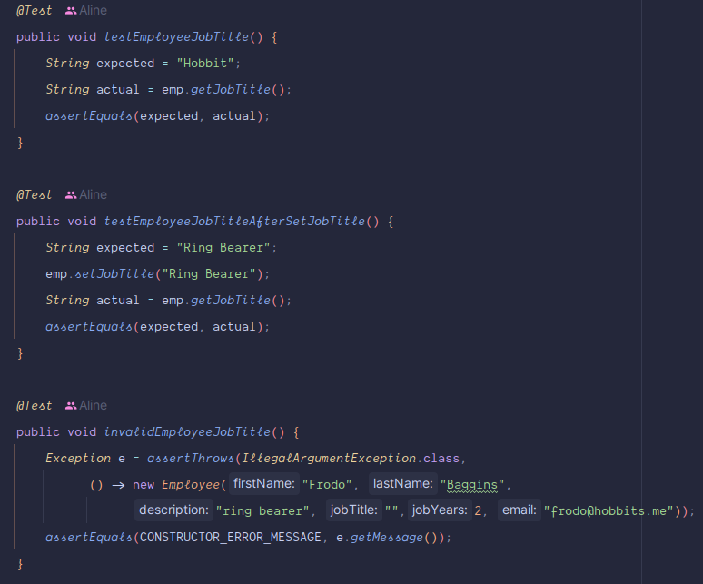
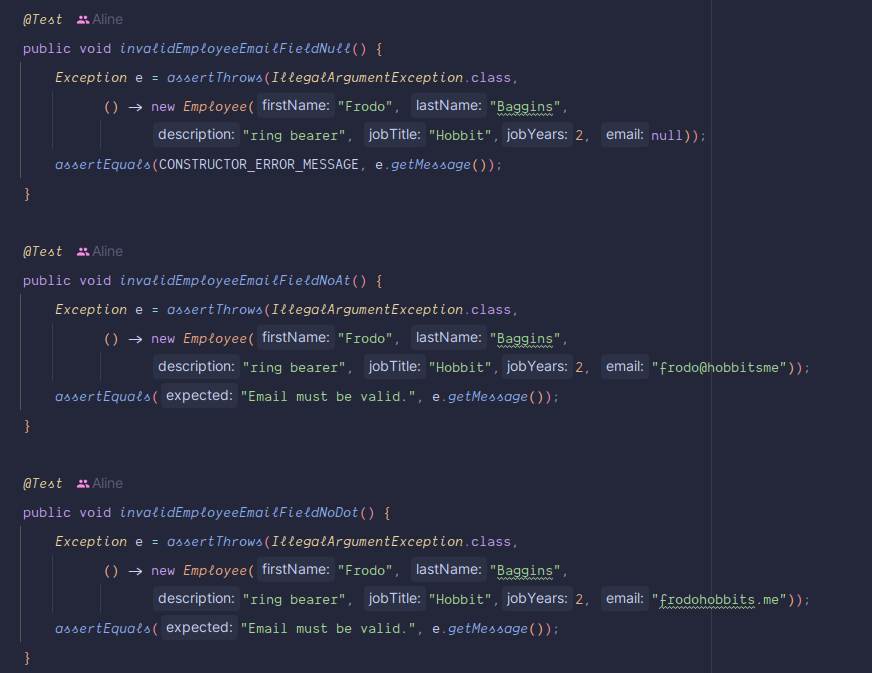
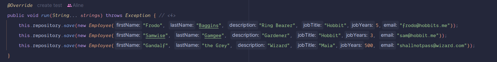
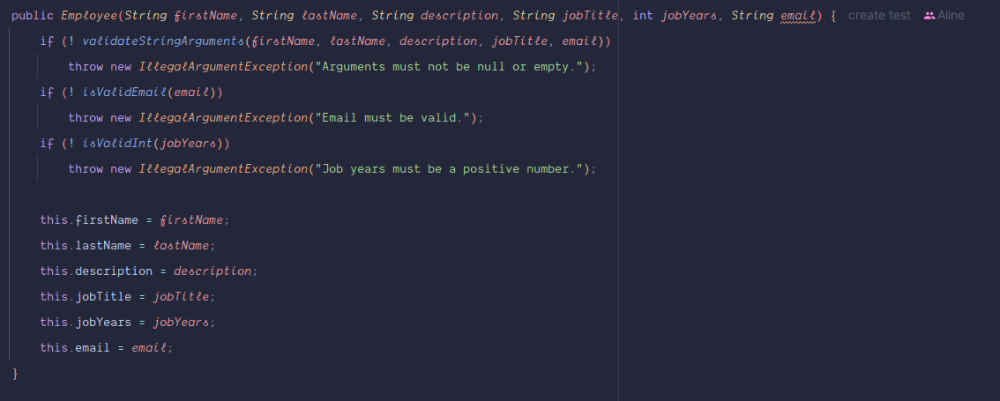

# Technical Report for CA1

## Final Result

## Part 1
### Step-by-Step Guide
#### Initial Setup
- **1. Initializing a New Git Repository**: Begin by initializing an empty Git repository in your local directory, or create a new one on GitHub.
- **2. Creating a .gitignore File**: Create a .gitignore file to avoid tracking unnecessary files. For example, for IntelliJ and Maven projects:
  - 2.1. Get the .gitignore file from `https://www.toptal.com/developers/gitignore?templates=java,intellij,maven`
  - 2.2. Paste the content into the .gitignore file in your project directory.
  - 2.3. Don't forget to commit and push the .gitignore file to the repository.
- **3. Cloning the Tutorial Project from GitHub**: Now, we will focus on another repository for a while. Clone this project from GitHub into any folder. For example:
  - 3.1. `git clone git@github.com:spring-guides/tut-react-and-spring-data-rest.git`
- **4. Navigating to the Project Directory**: Move to the basic directory of this project.
  - `cd ./tut-react-and-spring-data-rest/basic/`
- **5. Running the SpringBoot App**: Execute the command to run the SpringBoot app:
  - `./mvnw spring-boot:run`
- **6. Checking the Application**: Verify the application is running by accessing it through the browser: http://localhost:8080/
- **7. Creating a New Directory**:  Now we need to move the tutorial folder into our previously created repository. If the repository exists on GitHub, clone it locally. Next, create a new directory named "CA1" within the repository to store the assignment files, including the tutorial folder.
  - 7.1. `git clone git@github.com:line-em/devops-23-24-JPE-1231866.git`
  - 7.2. `mkdir CA1`
- **8. Navigating to the CA1 Directory**: Move to the newly created "CA1" directory.
  - 8.1. `cd ./CA1`
- **9. Going back to the tut-react-and-spring-data-rest folder**, delete the .git directory from the *“tut-react-and-spring-data-rest-main”* to avoid git tracking conflicts.
- **10. Moving the tut-react-and-spring-data-rest-main to the CA1 directory**: 
  - 10.1 `mv ./Class/tut-react-and-spring-data-rest-main ./CA1`
  - 10.2 You can rename the folder, if you want, to something like "tutorial".
- **11. Committing and Pushing to the GitHub Repository**:
  - 11.1. `git add .`
  - 11.2. `git commit -m “[CA1] - Add tutorial files to CA1”`
- **12. Warm Up**: After setting up, spend some time warming up. For instance, I did:
  - Modify the CSS, on commit #763301b5, [CSS] - Add custom CSS and Hanken Grotesk font. Closes #4. 
  - Add the jobTitle field, on commit #08503c70, [FEAT] - Add job title field. Closes #1.)
  - Tested the Employee class, on commit #653af61e, [TEST] - Add tests to Employee. Closes #5. 
  - It's important to properly use `git status, git add ., git commit -am, and git push` to keep track of the changes and commit them properly.
- **13. Now that everything is properly set up, you can start the assignment.** Tag this version as v1.1.0. I named it after the feature we're gonna add on the next part!
  - 13.1. `git tag -a v1.1.0 -m “add and support Employee's jobYears field.”`
  - 13.2. `git push --tags`
  - 13.3. `git tag` to verify if the tag was created.

#### Adding the jobYears Field
- **14. Opening the project on IntelliJ** - To avoid problems, I recommend opening the folder "tutorial" directly on IntelliJ. We will work on the basic folder that is inside the tutorial folder.
- **15 - Add the field jobYears to the Employee.** To properly add the field, it's necessary to:
  - 15.1. Add the field to the Employee class, adding it to its constructor.
  - 15.2. Add the field to the entries in the DatabaseLoader class.
  - 15.3. Add the field to the table in the app.js file.
  - 15.4. Add validation to the field in the Employee class.
  - 15.5. Add the field to the EmployeeTest class.
  - 15.6. Modify methods such as hashCode() and equals() to include the new field.
  - 15.7. Add the corresponding getters and setters.
  - 15.8. Run the tests and the application to check if everything is working properly.
- **16 - Tests** - We will first commit the tests for the Employee class. To do so, run the following commands:
  - 16.1. `git add .`
  - 16.2. `git commit -m “[JobYears] #Add tests to jobYears. Closes #3”`
  - 16.3. `git status` to check if everything is ok.
  - 16.4. `git push` to push the changes to the repository.
- **17 - Add methods to employees, including validation.** Do the same process as in the previous step, but now for the methods and validation of the jobYears field.
  - 17.1. `git add .`
  - 17.2. `git commit -m “[JobYears] Add methods to jobYears, validating Employee attributes. Closes #2 #6”`
  - 17.3. `git push`
- **18 - Optional - Add new entries**: If you want to add new entries to the database, you can do so by adding them to the DatabaseLoader class. After that, run the tests and the application to check if everything is working properly.
  - I did this in the commit `[Data] - Add new Employees. Closes #8`.
- **19 - Finishing touches and remaining steps**: Minor fixes and UI changes can be made here, to accommodate the new field. For example, I added the jobYears field to the table header in the app.js file.
  - I did this in the commit `[JobYears] - Add new field, jobYears, to the UI. Closes #13`
  - After that, run the tests and the application to check if everything is working properly.
- **20 - Tagging the version as v1.2.0**: After finishing the implementation, tag the version as v1.2.0.
  - 20.1. `git tag -a v1.2.0 -m “Support Employee's jobYears field completed.”`
  - 20.2. `git push --tags`
  - 20.3. `git tag` to verify if the tag was created.
- **21 - Complete the assignment**: After finishing the assigment, tag it as ca1-part1.
  - 21.1. `git tag -a ca1-part1`
  - 21.2. `git push --tags`
  - 21.3. `git tag` to verify if the tag was created.

## Part 2
### Step-by-Step Guide

#### Adding the email Field
- **1. Creating a New Branch**: Begin by creating a new branch for adding the email field.
  - 1.1. `git checkout -b email-field`
- **2. Verifying the Branch**: Make sure the branch was created successfully.
  - 2.1. `git branch -a`
- **3. Adding Email Field to Employee Class**: Add the email field to the Employee class and test it. Commit the tests for the Employee class first.
- **4. Adding Methods and Validation**: Add methods to Employee, including basic validation, and make fixes in the DatabaseLoader class, so the application can compile.
- **5. Adding Email Field to UI**: Add the email field to the table in the app.js file. 
  - Verify that everything is working properly before moving on!
- **6. Merging Changes**: Now, merge the email-field branch into the main branch.
  - 6.1. `git checkout main`
  - 6.2. `git merge email-field`
- **7. Creating a New Tag**: Create a new tag for this version.
  - 7.1. `git tag -a v1.3.0 -m "Support Employee's email field"`
- **8. Verifying Tag Creation**: Verify if the tag was created successfully.
  - 8.1. `git tag`
- **9. Pushing Changes and Tag**: Push the changes and the tag to the repository.
  - 9.1. `git push --tags`
- **10. Deleting the Branch**: To delete the branch locally, run the following command.
  - 10.1. `git branch -d email-field`
- **11. Deleting the Branch Remotely**: To delete the branch remotely, run the following command.
  - 11.1. `git push origin --delete email-field`

#### Validating the Email Field - Fix Invalid Email
- **12. Creating a New Branch**: Begin by creating a new branch for fixing invalid email.
  - 12.1. `git checkout -b fix-invalid-email`
- **13. Verifying the Branch**: Make sure the branch was created successfully.
  - 13.1. `git branch -a`
- **14. Adding Validation to Email Field**: Add validation to the email field in the Employee class by adding a method `isValidEmail`.
- **15. Adding Tests**: Add tests to the EmployeeTest class to validate the email field.
- **16. Merging Changes**: Now, merge the fix-invalid-email branch into the main branch.
  - 16.1. `git checkout main`
  - 16.2. `git merge fix-invalid-email`
- **17. Creating a New Tag**: Create a new tag for this version. This is a minor revision, so it will be v1.3.1.
  - 17.1. `git tag -a v1.3.1 -m "Add email specific validation for email field at Employee."`
- **18. Verifying Tag Creation**: Verify if the tag was created successfully.
  - 18.1. `git tag`
- **19. Pushing Changes and Tag**: Push the changes and the tag to the repository.
  - 19.1. `git push --tags`
- **20. Deleting the Branch**: To delete the branch locally, run the following command.
  - 20.1. `git branch -d fix-invalid-email`
- **21. Deleting the Branch Remotely**: To delete the branch remotely, run the following command.
  - 21.1. `git push origin --delete fix-invalid-email`

- **21 - Complete the assignment**: After finishing both tasks, tag it as ca1-part2.
  - 21.1. `git tag -a ca1-part2`
  - 21.2. `git push --tags`
  - 21.3. `git tag` to verify if the tag was created.

## The Final Result
Here are some screenshots of the final result. The application is running properly, with the new fields and validations added. The tests are also running properly.

### Tests
#### jobTitle

#### Invalid Email

(There are more tests in the EmployeeTestClass)

#### React UI

#### DatabaseLoader

### Employee Class Constructor
