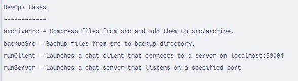

# Tutorial for CA2 - Part 1: Working with Gradle and Basic Demo Application

<!-- TOC -->
* [Tutorial for CA2 - Part 1: Working with Gradle and Basic Demo Application](#tutorial-for-ca2---part-1-working-with-gradle-and-basic-demo-application)
  * [Introduction](#introduction)
  * [Step 1: Download and Set Up the Example Application](#step-1-download-and-set-up-the-example-application)
  * [Step 2: Explore and Experiment with the Application](#step-2-explore-and-experiment-with-the-application)
  * [Step 3: Adding a New Task to Execute the Server](#step-3-adding-a-new-task-to-execute-the-server)
  * [Step 4: Adding a Simple Unit Test and Updating Gradle Script](#step-4-adding-a-simple-unit-test-and-updating-gradle-script)
  * [Step 5: Adding a New Task of Type Copy for Backup](#step-5-adding-a-new-task-of-type-copy-for-backup)
    * [Step 6: Adding a New Task of Type Zip to Make an Archive](#step-6-adding-a-new-task-of-type-zip-to-make-an-archive)
  * [Step 7: Tagging the Repository](#step-7-tagging-the-repository)
* [Author](#author)
<!-- TOC -->

## Introduction

In this tutorial, we will work with a basic Gradle project and make various modifications
to it, mainly related to **Gradle Tasks**. We will be using the example application
available at [Gradle Basic Demo](https://bitbucket.org/pssmatos/gradle_basic_demo/).

Ps: I used the following sources to help me in this tutorial:

- Gradle Docs, like
  the [Zip guide](https://docs.gradle.org/current/userguide/working_with_files.html#sec:creating_archives_example)
  and the [JUnit tutorial](https://docs.gradle.org/current/userguide/java_testing.html).
- https://tomgregory.com/gradle/gradle-tutorial-for-complete-beginners/

## Step 1: Download and Set Up the Example Application

1. Clone the example application repository into your local environment by running the
   following command in your terminal:

   ```bash
   git clone https://bitbucket.org/pssmatos/gradle_basic_demo.git
   ```

2. Move into the cloned directory, and delete the ```.git``` directory to avoid conflicts
   with your own repository:

   ```bash
   cd gradle_basic_demo
   rm -rf .git
   ```

## Step 2: Explore and Experiment with the Application

1. Open the `gradle_basic_demo` directory in your IDE. This will allow the IDE to better
   recognize the project structure and dependencies.

2. Read the instructions provided in the `readme.md` file to understand the structure and
   purpose of the application.

3. Experiment with running the application to familiarize yourself with its functionality.

4. If it doesn't work, it might be an issue with the Java or Gradle version. In my case, I
   have Java 21, so I had to update the gradle version in the project to accommodate the
   new Java version. I did this by editing the `gradle/wrapper/gradle-wrapper.properties`
   file and changing the `distributionUrl` to:

   ```properties
   distributionUrl=https\://services.gradle.org/distributions/gradle-8.6-all.zip
   ```

5. If all is well, you can commit the changes and push them to your repository:

   ```bash
   git commit -am "Updated gradle version to 8.6"
   git push
   ```

## Step 3: Adding a New Task to Execute the Server

1. Let's start by creating a new branch, before adding the new task:

   ```bash
   git checkout -b create-runServer-task
   ```

2. Open the `build.gradle` file in a text editor.

3. Add the following task definition to execute the server:

   ```groovy
   tasks.register('runServer', JavaExec) {
   dependsOn classes
   group = "DevOps"
   description = "Launches a chat server that listens on a specified port"
   
       classpath = sourceSets.main.runtimeClasspath
   
       mainClass = 'basic_demo.ChatServerApp'
   
       args '59001'
   }
   ```
   

4. After that, we can run the task by executing the following command in the terminal:

   ```bash
    ./gradlew runServer
    ```

   

5. You can also run the client to fully test the server:

   ```bash
   ./gradlew runClient
   ```

6. If everything works as expected, you can commit the changes to the repository:

   ```bash
   git commit -am "Added runServer task"
   ```
   
7. Now we need to go to the main branch and merge the changes:

   ```bash
   git checkout main
   git merge --no-ff create-runServer-task
    ```
   
8. Finally, push the changes to the repository:

   ```bash
   git push
   ```

9. You can also push the branch to the repository:

   ```bash
   git push origin create-runServer-task
   ```

## Step 4: Adding a Simple Unit Test and Updating Gradle Script

1. Let's start by creating a new branch, before adding the new task:

   ```bash
   git checkout -b add-junit-tests
   ```

2. First, we will need to add the JUnit dependency to the project. This can be done by
   adding the following line to the `build.gradle` file, if it's not already there:

   ```groovy
   test {
   useJUnitPlatform()
   }
   ```

3. After that, we can add the dependency to the `build.gradle` file:

   ```groovy
   dependencies {
   // ... previous dependencies
   testImplementation 'org.junit.jupiter:junit-jupiter-api:5.8.1'
   testRuntimeOnly 'org.junit.jupiter:junit-jupiter-engine:5.8.1'
   }
   ```
   
   

4. Now we're ready to add some tests. Create a new directory
   named `src/test/java/basic_demo` in the project root directory.

5. Inside the `src/test/java/basic_demo` directory, create a new Java class for the unit
   test, for example, `AppTest.java`.

   ```java
   package basic_demo;
   
   import org.junit.jupiter.api.Test;
   
   import static org.junit.jupiter.api.Assertions.assertNotNull;
   
   public class AppTest {
   @Test
   public void testAppHasAGreeting() {
   App classUnderTest = new App();
   assertNotNull("app should have a greeting", classUnderTest.getGreeting());
   }
   }
   ```

6. You can verify that if worked by running the tests and, for instance, generating the following report.

   ```bash
   ./gradlew clean test --info
    ```

7. It will be available at `build/reports/tests/test/index.html`.

   

8. If everything works as expected, you can commit the changes to the repository:

   ```bash
   git commit -am "Added JUnit test"
   ```
   
9. Now we need to go to the main branch and merge the changes:

   ```bash
    git checkout main
    git merge --no-ff add-junit-tests
    ```
   
10. Finally, push the changes to the repository:

    ```bash
    git push
    ```

11. You can also push the branch to the repository:

    ```bash
     git push origin add-junit-tests
     ```

## Step 5: Adding a New Task of Type Copy for Backup

1. Let's start by creating a new branch, before adding the new task:

   ```bash
   git checkout -b ca2-add-copy-task
   ```

2. Add the following task definition to copy the sources of the application for backup:

   ```groovy
   tasks.register('backupSrc', Copy) {
   group = "DevOps"
   description = "Backup files from src to backup directory."
   
       from layout.projectDirectory.dir("src/main")
       into layout.projectDirectory.dir("src/backup").dir("main")
   }
   ```
   
   

3. After that, we can run the task by executing the following command in the terminal:

   ```bash
   ./gradlew backupSrc
   ```
   
   
   
4. If everything works as expected, you can commit the changes to the repository:

   ```bash
    git commit -am "Added backupSrc task"
    ```
   
5. Now we need to go to the main branch and merge the changes:

   ```bash
    git checkout main
    git merge --no-ff ca2-add-copy-task
    ```
   
6. Finally, push the changes to the repository:

   ```bash
   git push
   ```
   
7. You can also push the branch to the repository:

   ```bash
    git push origin ca2-add-copy-task
    ```

### Step 6: Adding a New Task of Type Zip to Make an Archive

1. Let's start by creating a new branch, before adding the new task:

   ```bash
   git checkout -b ca2-add-zip-task
   ```

2. Add the following task definition to create a zip archive of the application sources:

   ```groovy
   tasks.register('archiveSrc', Zip) {
   group = "DevOps"
   description = "Compress files from src and add them to src/archive."
   archiveFileName = "gradleChat.zip"
   destinationDirectory = layout.projectDirectory.dir("src/archive")
   
       from layout.projectDirectory.dir("src/main")
   }
   ```
   
   

3. After that, we can run the task by executing the following command in the terminal:

   ```bash
   ./gradlew archiveSrc
   ```
   
   
   
4. If everything works as expected, you can commit the changes to the repository:

   ```bash
    git commit -am "Added archiveSrc task"
    ```
   
5. Now we need to go to the main branch and merge the changes:

   ```bash
    git checkout main
    git merge --no-ff ca2-add-zip-task
    ```
   
   

6. Finally, push the changes to the repository:

    ```bash
    git push
    ```
   
7. You can also push the branch to the repository:

   ```bash
    git push origin ca2-add-zip-task
    ```
   
8. At this point, your folder structure should have both the backup files, and the archived files:

   

9. Lastly, check the tasks available in the project. It should look, more or less, like the following image.

   ```bash
   ./gradlew tasks
   ```

   

## Step 7: Tagging the Repository

At the end of Part 1 of this assignment, mark your repository with the tag `ca2-part1` by
running:

```bash
git tag -a ca2-part1 -m "Completed part1 from CA2"
git push --tags
```

Your branching structure should look somewhat like the following:


Thank you!

# Author
- [Aline Emily](https://github.com/line-em), 1231866
- Repository: https://github.com/line-em/devops-23-24-JPE-1231866/
