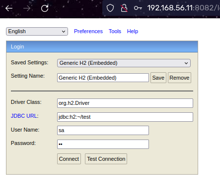
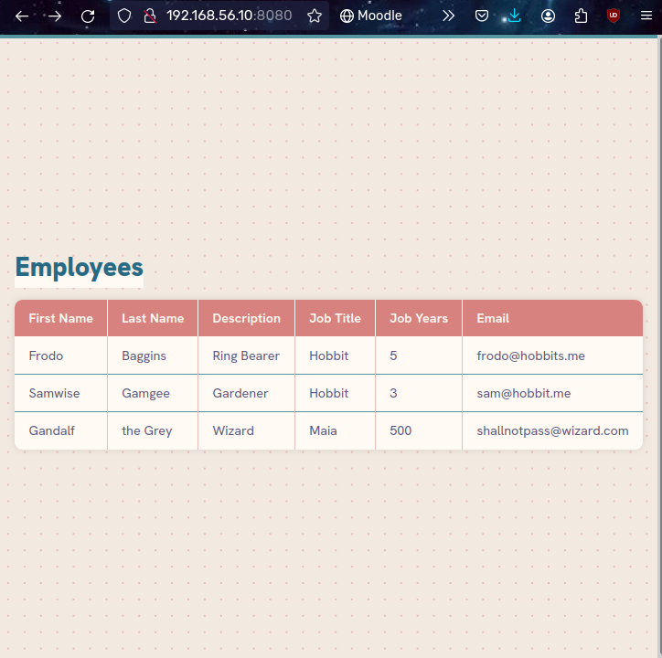

# Technical Report for CA3 Part 2

First of all, we need the base Vagrantfile we will use for this assignment, which you can
find [here](https://bitbucket.org/pssmatos/vagrant-multi-spring-tut-demo/).

However, in order to make it run our application, we will need to make changes to this
file.

## Cloning our repository

We will need to change the clone url. We will change the tut-basic-gradle to our
repository, and navigate to the correct folder. Mine looks like this:

```
git clone git@github.com:line-em/devops-23-24-JPE-1231866.git  
cd devops-23-24-JPE-1231866/CA2/Part2
```

This won’t work out of the box, however. So we will need to change our repository
visibility to public, which I did.

I still had to make some changes to the Vagrantfile, in order to make it work. I added the
following lines to the Vagrantfile:

```
config.ssh.forward_agent = true  
config.ssh.insert_key = true
```

And then I added this bit at the web configurations, before the clone:

```
ssh-keyscan -H github.com >> ~/.ssh/known_hosts
```

Mostly based on these
instructions: https://stefanscherer.github.io/access-private-github-repos-in-vagrant-up/

## Updating dependencies

I found useful to update the ubuntu version for the VM, and to update the Java version to
17. That way, things work as expected.

**Ubuntu 20**

```
config.vm.define "web" do |web|
    web.vm.box = "generic/ubuntu2004"
    
config.vm.define "db" do |db|  
  db.vm.box = "generic/ubuntu2004"
  
Vagrant.configure("2") do |config|  
    config.vm.box = "generic/ubuntu2004"
```

**Java 17**

```
sudo apt-get install -y iputils-ping avahi-daemon libnss-mdns unzip \  
    openjdk-17-jdk-headless
```

Lastly, I added the following after `./gradlew clean build` :

```
./gradlew bootRun
```

That way, the VM initializes as it should, and the web client is up and running.

You can open your browser and verify both the db (http://192.168.56.11:8082/), as the web
instance (http://192.168.56.10:8080/)

Here are screenshots of my results:




# VirtualBox alternative

There are a few alternatives to VirtualBox, such as QEMU and VMAware. Here are some
differences between the two:
**Performance and Scalability:**

* VirtualBox: Better for desktop use, offers smoother performance.
* QEMU: More lightweight, suitable for headless servers.

**Feature Set:**

* VirtualBox: User-friendly interface, snapshot management, seamless mouse integration.
* QEMU: Supports various hardware architectures, disk image formats, and networking
  options, often used with libvirt for management.

**Platform Support:**

* VirtualBox: Available on Windows, macOS, and Linux.
* QEMU: Primarily used on Linux but can be compiled for other platforms.

**Integration with Vagrant:**

* VirtualBox: Native support in Vagrant, commonly used.
* QEMU: Can be used with Vagrant through plugins or by specifying in Vagrantfile, may
  require additional setup.

# Author

- [Aline Emily](https://github.com/line-em), 1231866
- Repository: https://github.com/line-em/devops-23-24-JPE-1231866/