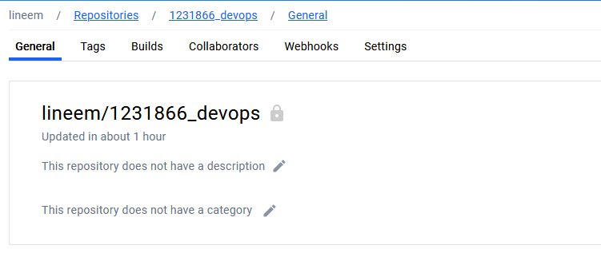
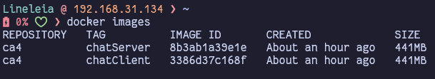
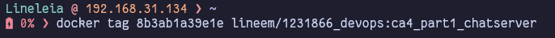
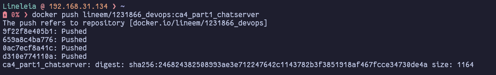
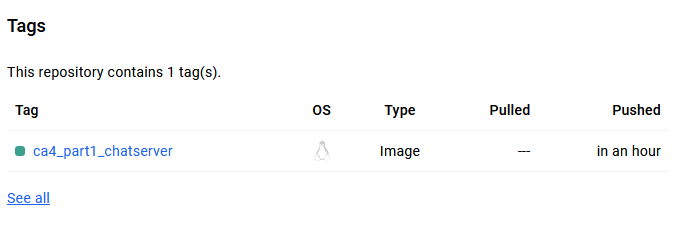
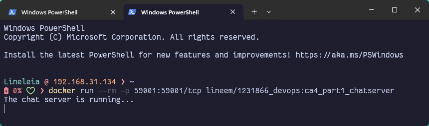
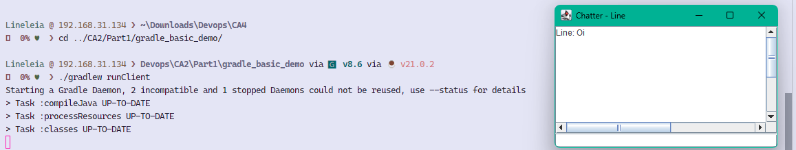
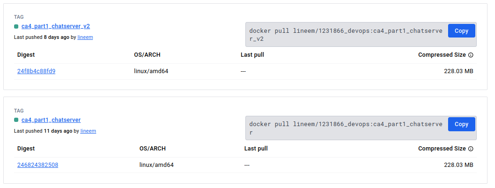

# Technical Report: CA4 Part1 - Docker

<!-- TOC -->
* [Technical Report: CA4 Part1 - Docker](#technical-report-ca4-part1---docker)
  * [Introduction](#introduction)
  * [Writing the Dockerfile v1 - Build the chat server "inside" the Dockerfile](#writing-the-dockerfile-v1---build-the-chat-server-inside-the-dockerfile)
  * [Build the Dockerfile and Push it to Docker Hub.](#build-the-dockerfile-and-push-it-to-docker-hub)
  * [Run our Chat Application](#run-our-chat-application)
  * [Writing the Dockerfile v2 - Build the chat server in the host computer, and copy it to the Dockerfile.](#writing-the-dockerfile-v2---build-the-chat-server-in-the-host-computer-and-copy-it-to-the-dockerfile)
  * [Build the Dockerfile and Push it to Docker Hub](#build-the-dockerfile-and-push-it-to-docker-hub-1)
  * [Conclusion](#conclusion)
* [Author](#author)
<!-- TOC -->

## Introduction

The goal of this assignment is to practice using Docker to create images and run containers for a Java-based chat application. Specifically, we will package and execute the chat server in a Docker container. The chat server will be built from a Dockerfile, tagged, and published on Docker Hub. Additionally, the chat client will be executed on the host machine, connecting to the chat server running in the container.

## Writing the Dockerfile v1 - Build the chat server "inside" the Dockerfile

As the application is built on Gradle and Java, I have created a Docker file based on `gradle:jdk21`. You can access it on /v1/Dockerfile, or you can see it below, with some annotations with my thought process.

This is created for the first part of the assignment, "In this version you should build the chat server ”inside” the Dockerfile". That being said, the build occurs in the container.

```dockerfile
# Stage 1: Build the application using Gradle
FROM gradle:jdk21 as builder
# Use your own name as an author label.
LABEL author="Aline Emily"

# Set the working directory inside the container
WORKDIR /CA4/Part1

# Clone the repository containing the Gradle project
RUN git clone https://bitbucket.org/pssmatos/gradle_basic_demo.git

# Change directory to the cloned repository
WORKDIR /CA4/Part1/gradle_basic_demo

# Build the project using Gradle
RUN gradle build

# Stage 2: Run the application using a slim JDK image
FROM openjdk:21-jdk-slim

# Copy the built jar from the builder stage to the final image
COPY --from=builder /CA4/Part1/gradle_basic_demo/build/libs/*.jar /CA4/Part1/CA_PART1.jar

# Expose the port the server will use to listen for connections
EXPOSE 59001

# Set the command to run the server application - the command is adapted from the README instructions in the Bitbucket Repository.
CMD ["java", "-cp", "/CA4/Part1/CA_PART1.jar", "basic_demo.ChatServerApp", "59001"]
```

## Build the Dockerfile and Push it to Docker Hub.

1. To build the Docker image, navigate to the directory containing the Dockerfile and do a `docker build` command. Mine had the following options:
    ```bash
    docker build --rm -f "Part1\v1\Dockerfile" -t ca4:chatServer
    ```
    You can check all possibilities in the [documentation](https://docs.docker.com/reference/cli/docker/image/build/). The ones I used stands for:
    - rm: Remove intermediate containers after a successful build
    - f: Name of the Dockerfile. If you are already in the folder containing the Dockerfile, you can just use a dot (.), for instance `docker build -t chat-server .`
    - t: Name and optionally a tag in the name:tag format. in my case, I named it ca4:chatServer.
2. Check if all is working properly and if there are no compilation errors. You can run the container using `docker run --rm ca4:chatServer` or similar, using the name:tag of the Docker Image.
3. If all went well, go ahead and create a new repository on Docker Hub. Here's what mine looks like:
   
4. You should tag the Docker image with the appropriate name before pushing it to DockerHub, as it is necessary to use the name of the intended repository. First, however, let's get our docker image id with `docker images`
   
5. You can now use this ID to tag your Docker Image. You can reference the id as the example below. Don't forget the name:tag pattern!
   
6. Now we can finally push our Docker image! Please make sure you're currently logged in, with `docker login`, and then run the following command:
   `docker push name:tag`
   
7. Now you should see your docker image in your repository, such as the example below:
   

## Run our Chat Application

1. It's important to check the chat application, to be sure it works as intended. We will run our server on Docker. You can use a command such as below:
    ```bash
    docker run --rm -p 59001:59001 lineem/1231866_devops:ca4_part1_chatserver
    ```
    
    - The `--rm` will remove the container when it exits, and the `-p` will publish the specified port to the host.
2. As for the Client, I went to my IDE and used the command `./gradlew runClient`. You can use `gradle runClient` if you have Gradle installed instead.
   

## Writing the Dockerfile v2 - Build the chat server in the host computer, and copy it to the Dockerfile.

For the alternative version, I made a few changes in my Dockerfile. It became as follows:

```dockerfile
FROM openjdk:21-jdk-slim
LABEL author="Aline Emily"

WORKDIR /CA4/Part1

COPY ./*.jar /CA4/Part1/CA_PART1.jar

EXPOSE 59001

CMD ["java", "-cp", "/CA4/Part1/CA_PART1.jar", "basic_demo.ChatServerApp", "59001"]
```

It's modified from the first version, so there's no build step in the Dockerfile. It will copy a jar file from the host computer to the Docker container.

In my case, I copied the results from the build to the /v2 folder, so it would be easier to reference it in the `COPY` COMMAND.

Don't forget to test this implementation before moving on to the next step! You should run the Client in your host machine and the Server in the Docker container, as before.

## Build the Dockerfile and Push it to Docker Hub

I followed the same steps as before, but with a different tag. The commands are as follows:

To build the Docker image:
```bash
docker build --rm -f "Part1\v2\Dockerfile" -t ca4:chatServerV2
```

To check if all is working properly:
```bash
docker run --rm -d -p 59001:59001/tcp ca4:chatServerV2
```

To tag the Docker image:
```bash
docker tag IMAGE_ID lineem/1231866_devops:ca4_part1_chatserver_v2
```

To push the Docker image:
```bash
docker push lineem/1231866_devops:ca4_part1_chatserver_v2
```

## Conclusion

This assignment was a great opportunity to practice using Docker to create images and run containers for the gradle chat application. I learned how to write Dockerfiles, build Docker images, and run containers, and get familiar with a few Docker commands. 

The final result can be seen in the Docker Hub repository, where the images are stored: https://hub.docker.com/r/lineem/1231866_devops/tags



Thank you!

# Author
- [Aline Emily](https://github.com/line-em), 1231866
- Repository: https://github.com/line-em/devops-23-24-JPE-1231866/