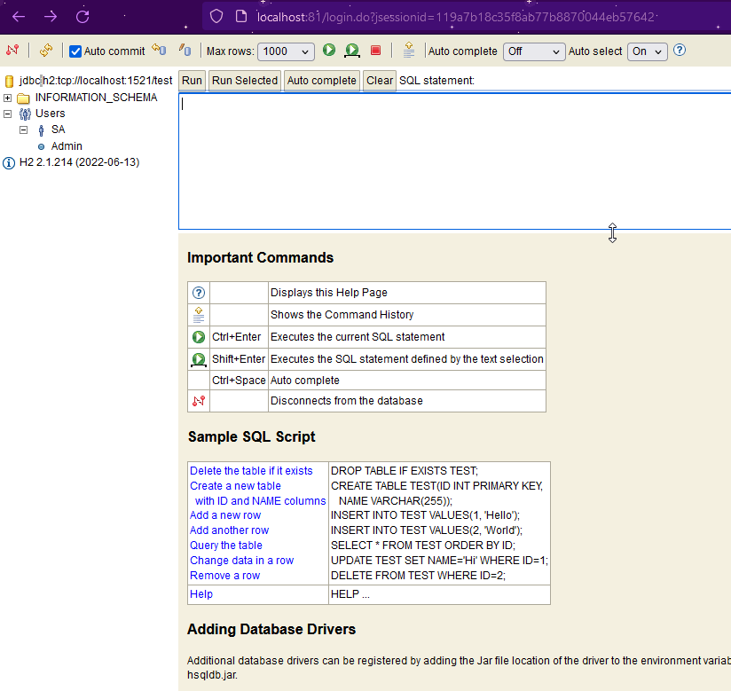

# Technical Report: CA4 Part2 - Docker Compose

## Table of Contents

- [Technical Report: CA4 Part2 - Docker Compose](#technical-report-ca4-part2---docker-compose)
  - [Table of Contents](#table-of-contents)
  - [Introduction](#introduction)
  - [Docker Compose and Dockerfile](#docker-compose-and-dockerfile)
    - [The web Dockerfile](#the-web-dockerfile)
    - [The Docker Compose file.](#the-docker-compose-file)
  - [Running the Docker Compose file](#running-the-docker-compose-file)
  - [Publishing the Images to Docker Hub](#publishing-the-images-to-docker-hub)
  - [Copying the database using Volumes.](#copying-the-database-using-volumes)
  - [Conclusion](#conclusion)
- [Author](#author)

## Introduction

The goal of this assignment is to use Docker to set up a containerized environment to execute our version of the Gradle version of the **Spring basic tutorial** application, made at *CA2/PART2*. We will be using Docker Compose to create two containers: one for running Tomcat and the Spring application (`web`), and another for executing the H2 server database (`h2-db`). We can take a look at our ``Vagrantfile`` from *CA3/PART2*, and compare the solutions.

The images will be published to Docker Hub, and we will use a volume with the `db` container to get a copy of the database file.

## Docker Compose and Dockerfile

First, let's break down what we should do in this assignment:

- The `docker-compose.yaml` file should define two services: `web` and `h2-db`. The `web` service builds from a Dockerfile in the current directory and exposes port 8080. The `h2-db` service uses the `oscarfonts/h2:latest` image and exposes port 1521.

- The Dockerfile will use `gradle:jdk21` image as a builder, clone the repository containing the Gradle project, build the project using Gradle, and then copy the built `.jar` file to the final image. It will, then, run the Spring Boot application.

Let's start by building our Dockerfile.

### The web Dockerfile

Based on what we specified earlier, we can draft the Dockerfile like this:

```dockerfile
FROM gradle:jdk21 as builder
LABEL author="Aline Emily"

WORKDIR /CA4/Part2
RUN git clone https://github.com/line-em/devops-23-24-JPE-1231866.git

WORKDIR /CA4/Part2/devops-23-24-JPE-1231866/CA2/Part2
RUN gradle build
EXPOSE 8080

COPY *.jar /CA4/Part2/

CMD [ "gradle", "bootRun" ]
```

Take special care while using the WORKDIR and COPY commands, so it navigates to the correct folders. 
Also, take care to choose a base image that corresponds your project dependencies.

### The Docker Compose file.

For the Docker Compose file, we will guide Docker on how we want our containers to be built. Here are some considerations I made:

**DB**:
- I choose to use the ``oscarfonts/h2:latest`` image, as it was a good, up-to-date h2 image, that served my needs. It uses, by default, ports 81:81 for the Web Console server, and 1521 for the TCP Server. This is different from our ``Vagrantfile``, in which our DB ran in ports 8082.
- I also defined a volume, which will be useful for the last part of the assignment.
- 
**WEB**
- I am using my Dockerfile to build the Gradle application. As a consequence, the *image* command afterwards will allow me to tag the image the way I want it to. Therefore, I am tagging it `lineem/1231866_devops:ca4_part2_web`, so I can push it later to **Docker Hub**.
- The ports I'm exposing are the same ones as the ports exposed by the `Vagrantfile`: 8080.
- The web container depends on the DB container to run.
- 
**VOLUME**
- The volume I created at the **DB** part is referenced here. The database files will be sent to the path */opt/h2-data*.

Here's how the final file looks like:

```yml
services:
    db:
        image: oscarfonts/h2:latest
        container_name: h2-db
        ports:
            - "81:81"
            - "1521:1521"
        volumes:
            - h2-data:/opt/h2-data

    web:
        build:
            context: .
            dockerfile: Dockerfile
        image: lineem/1231866_devops:ca4_part2_web
        container_name: web
        ports:
            - "8080:8080"
        depends_on:
            - db

volumes:
    h2-data:
        driver: local

```

The Docker Compose file (`docker-compose.yaml`) and Dockerfile (``Dockerfile``) can be found at this folder.

## Running the Docker Compose file

To run our docker compose file, and generate our containers, here's what we need to do:

Navigate to the directory of your `docker-compose.yaml`, and run the following command:

```bash
docker compose up
```

It should run our docker compose file, and build the images if they aren't already in your system.
You can check the images by running:

```bash
docker compose images
```


Here's some screenshots on how it should look like:


You can access the pages on the following links:
- Web Console H2 - http://localhost:81/
- The TCP Server - http://localhost:1521/ (which doesn't have an UI)
- Web UI - http://localhost:8080/

Here's some screenshots of my results.


However, I found one issue when logging in at the H2 Web Console, as the db wasn't being created automatically.
To fix that, I had to add an argument, `-ifNotExists` to *$H2_OPTIONS*, like this:

```yaml
db:
    image: oscarfonts/h2:latest
    container_name: h2-db
    ports:
        - "81:81"
        - "1521:1521"
    volumes:
        - h2-data:/opt/h2-data
    environment:
        - H2_OPTIONS=-ifNotExists
```

Now I can successfully login with the default password and user.



## Publishing the Images to Docker Hub

Now that everything is working as expected, we need to tag our images properly in order to publish them on Docker Hub.
Fortunately, our web image is already with the correct tag, `lineem/1231866_devops:ca4_part2_web`, and won't need fixes. The db, however, will need to be tagged as `lineem/1231866_devops:ca4_part2_db`.

Here's how to do that.

First, let's get our identifiers, so we can tag the db. Go to the `docker-compose` directory, and run:

```bash
docker compose images
```

Then, make sure to be logged in at docker.

```bash
docker login
```

You can now tag the image as you wish. Mine looked like this:

```bash
docker tag 7816f131ef42 lineem/1231866_devops:ca4_part2_db
```

Here's a screenshot on how this workflow might look.


Lastly, push the images to Docker Hub - both the db *and* the web image!

```bash
docker push lineem/1231866_devops:ca4_part2_db
docker push lineem/1231866_devops:ca4_part2_web
```


Here's a screenshot on how it looks on Docker Hub:


## Copying the database using Volumes.

My image currently has a Volume called **h2-data**, and it saves the database files to */opt/h2-data*. However, it does not make any backups/copies to other directories/volumes, and we will need to fix that.

First, let's check our Volume information by running the following:

```bash
docker volume ls
docker volume inspect part2_h2-data
```


Here you can verify if everything is working as expected so far, or if you have any problems before we proceed.

Now: we need to make some changes to our `docker-compose.yaml` file in order to copy the database file. As an important note about the snippet below, please note that I'm running Docker on **Windows**. But if you're using Linux or MAC, you might have to tweak the path to your OS needs.

Without further ado, however, here's how it might look like:

```yml
db:
    image: oscarfonts/h2:latest
    container_name: h2-db
    ports:
        - "81:81"
        - "1521:1521"
    volumes:
        - h2-data:/opt/h2-data
        - "C:/Users/line-leia/Downloads/DevOps/CA4/Part2/db:/opt/h2-backup/"
    environment:
        - H2_OPTIONS=-ifNotExists
```

We're now binding the local directory `C:/Users/line-leia/Downloads/DevOps/CA4/Part2/db` to the `/opt/h2-backup` folder in our instance.

You can now run our `docker-compose` file again, so we can begin copying the db file.

```bash
docker compose up
```

Please check your containers, volumes, etc, to be sure everything is working correctly before continuing.

We now need to access our image in order to copy our database file from `/opt/h2-data` to `/opt/h2-backup`. Please note that, if your folder `/opt/h2-data` is empty, you might need to login to the database on http://localhost:81 in order to generate the database file.

Here's an example of how you can copy your files:


And now, navigating on Host to the folder we specified, `C:/Users/line-leia/Downloads/DevOps/CA4/Part2/db`, we can access the database file.


Everything is, then, working as intended. The database file above is available in this repository, at the path /CA4/Part2/db.

We can now update our image on Docker Hub in order to reflect those changes.

## Conclusion

This assignment demonstrates how to use Docker and Docker Compose to set up a containerized environment for a Spring application with a separate database service. The images are published to Docker Hub, and a volume is used to get a copy of the database file. The Docker Compose file and Dockerfile used in this assignment are included in the repository.

You can access the Docker Hub page here: https://hub.docker.com/r/lineem/1231866_devops/tags

Finally, to mark the repository with the tag `ca4-part2`, you can use the following command:

```bash
git tag -a ca4-part2 -m "Completed CA4 Part2"
git push --tags
```

# Author
- [Aline Emily](https://github.com/line-em), 1231866
- Repository: https://github.com/line-em/devops-23-24-JPE-1231866/