# Technical Report CA5: Jenkins Project

<!-- TOC -->

- [Technical Report CA5: Jenkins Project](#technical-report-ca5-jenkins-project)
  - [Introduction](#introduction)
  - [Prerequisites](#prerequisites)
  - [CA5 Part 1](#ca5-part-1)
    - [Result](#result)
  - [CA5 Part 2](#ca5-part-2)
    - [Docker Setup](#docker-setup)
    - [Docker Permissions](#docker-permissions)
    - [Results](#results)
- [Conclusion](#conclusion)
- [Author](#author)

<!-- TOC -->

## Introduction

The Jenkins pipeline scripts created in this CA are designed to automate the build, test, archive and others stages of a Gradle project located in the `CA2/Part1/gradle_basic_demo` and `CA2/Part2` directories.

This will allow us to understand how Jenkins works, and the various ways it can automate our projects, saving us a lot of effort and time.

## Prerequisites

To follow this tutorial, you need to have **Jenkins** installed and properly configured.
This includes setting up the necessary Jenkins plugins - in this case, **publishHTML, Javadoc and Docker related plugins**.

You can install Jenkins on Docker, using the following image:
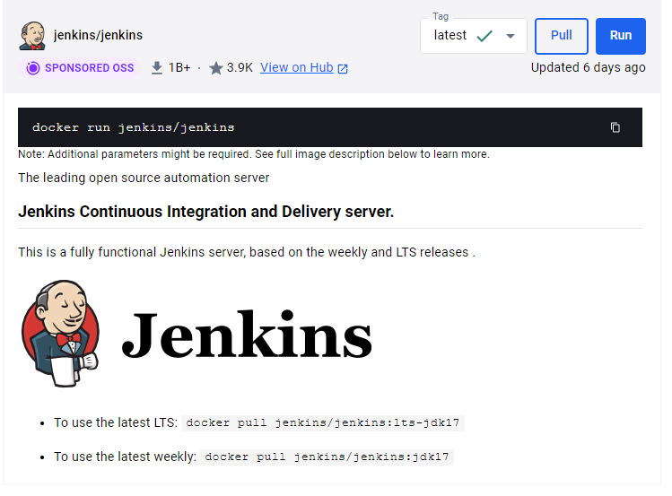

You might also need to configure Jenkins authentication if it's your first time using it.
You can follow the instructions on the `docker logs`

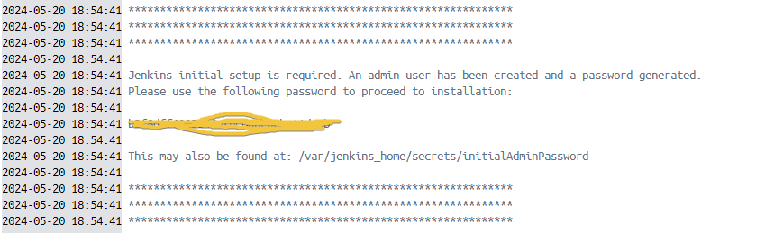

## CA5 Part 1

The first part of the CA5 is to practic with our project Gradle Basic Demo. So that's what we're going to do!

Our Jenkinsfile for this project should include the following tasks: Checkout, Assemble, Test and Archive. Please remember that it follows the groovy language and syntax. Here's what mine looks like:

```groovy
pipeline {
    stages {
        stage('Checkout') {
            steps {
                echo 'Checking Out...'
                script {
                    git branch: 'main',
                            url: 'https://github.com/line-em/devops-23-24-JPE-1231866.git'
                }
            }
        }
        stage('Assemble') {
            steps {
                dir('./CA2/Part1/gradle_basic_demo') {
                    echo 'Assembling...'
                    sh './gradlew assemble'
                }
            }
        }
        stage('Test') {
            steps {
                dir('./CA2/Part1/gradle_basic_demo') {
                    echo 'Testing...'
                    sh './gradlew test'
                }
            }
            post {
                always {
                    junit '**/build/test-results/**/*.xml'
                }
            }
        }
        stage('Archive') {
            steps {
                echo 'Archiving...'
                archiveArtifacts artifacts: 'CA2/Part1/gradle_basic_demo/build/**/*.jar', onlyIfSuccessful: true
            }
        }
    }
}
```

Please verify if all the directories are alright, as this can cause some trouble. Also, please take note that this repository is public - for private repositories, you might need to tweak the process to include your credentials!

We also need to create our pipeline at Jenkins. At your **Dashboard**, go to **New Item > Pipeline** and name it the way your prefer. Mine is *ca5_part1*.

You need to configure Jenkins to find and run our pipeline script properly though, so click on **Configure**, go to **Pipeline** and do the following:

- Select **Pipeline Script on SCM** on Definition
- Choose **Git**
- Add your repository and credentials, if you have any.
- Choose your **branch**. I specified that mine runs on *origin/main*.
  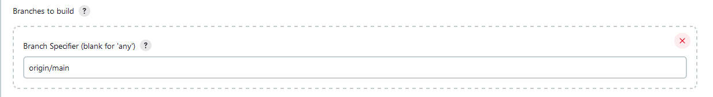
- Specify your Jenkinsfile path. Mine is on *CA5/Part1/Jenkinsfile*.
- If you encounter any problems, disable **Lightweight Checkout**. Mine is checked off.

You might need to tweak this process depending on your configurations and project.
Fortunately, Jenkins is very intuitive and when certain tasks fail, you can easily detect what went wrong:

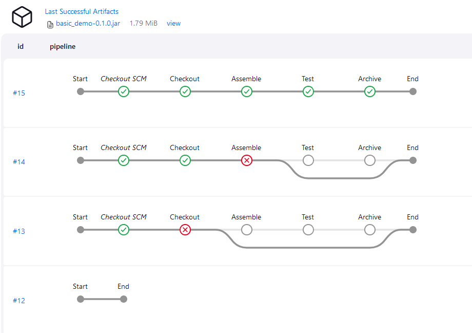

### Result

If your pipeline runs successfully, you should encounter a view such as this, fully in green:

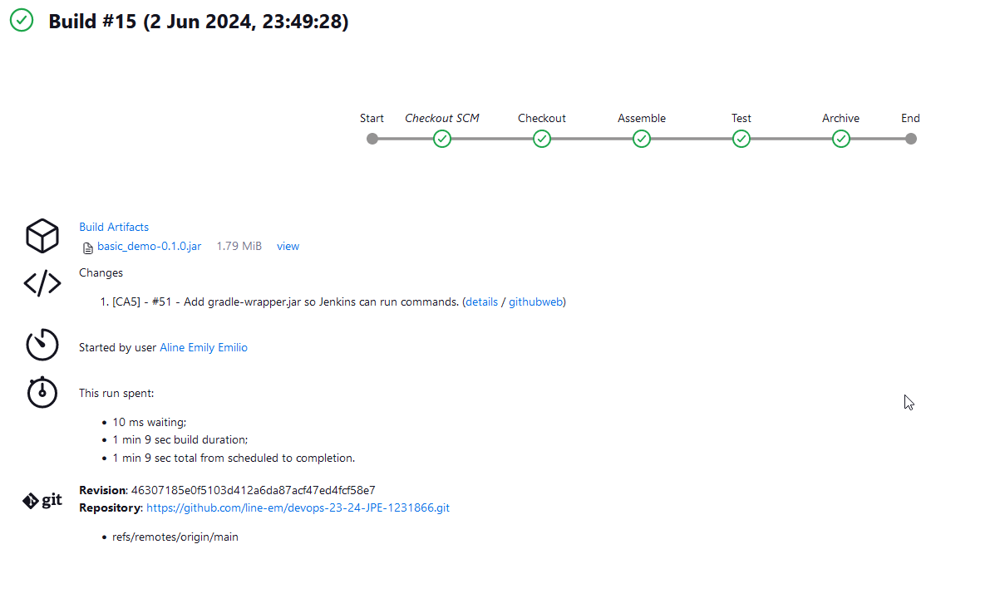


You can rename your builds for an easier time searching, and also check the results of several steps, such as the Tests:

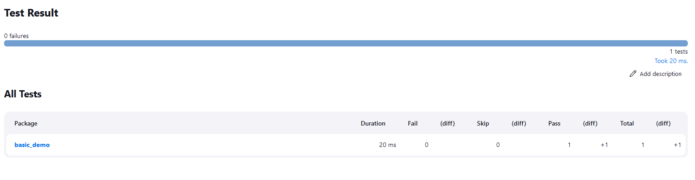

Now we're ready for the second part for this assignment!

## CA5 Part 2

For the second part, we need to create a new Jenkinsfile for our CA2/Part2 project. We will have the following stages: Checkout, Assemble, Test, Javadoc, publishHTML, Archive, and Publish Image, in order to generate a docker image and push it to Docker Hub.

First, install the following plugin in order to make our publishHTML stage work:

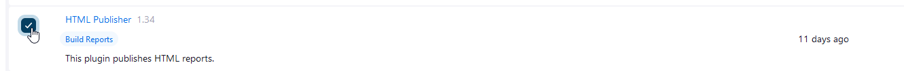

Jenkins has a Pipeline Syntax configurator that can help generating our code for this stage:

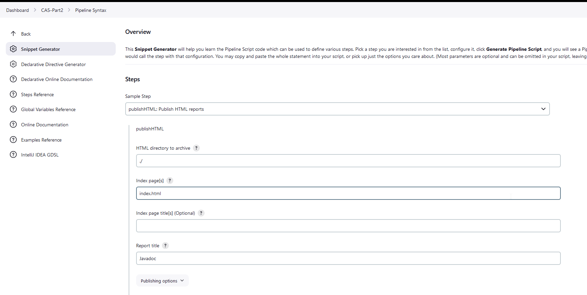

You can also install the **Docker Pipeline** plugin for later.

With that settled, we can write our Jenkinsfile. Here's how mine looks like:

```groovy
/* groovylint-disable CompileStatic */
pipeline {
    agent any
    environment {
        DOCKER_CREDENTIALS_ID = 'DOCKER_1231866'
        DOCKER_IMAGE = 'lineem/1231866_devops_ca5'
        DOCKER_TAG = "${env.BUILD_ID}"
    }
    tools {
        'org.jenkinsci.plugins.docker.commons.tools.DockerTool' 'Docker'
    }
    stages {
        stage('Checkout') {
            steps {
                echo 'Checking Out...'
                script {
                    git branch: 'main',
                            url: 'https://github.com/line-em/devops-23-24-JPE-1231866.git'
                }
            }
        }
        stage('Assemble') {
            steps {
                dir('./CA2/Part2') {
                    echo 'Assembling...'
                    sh './gradlew assemble'
                }
            }
        }
        stage('Test') {
            steps {
                dir('./CA2/Part2') {
                    echo 'Testing...'
                    sh './gradlew test'
                }
            }
            post {
                always {
                    junit '**/build/test-results/**/*.xml'
                }
            }
        }
        stage('Javadoc') {
            steps {
                dir('./CA2/Part2') {
                    echo 'Generating Javadoc...'
                    sh './gradlew javadoc'
                }
            }
            post {
                always {
                    publishHTML([
                            allowMissing          : false,
                            alwaysLinkToLastBuild : false,
                            keepAll               : false,
                            reportDir             : './CA2/Part2/build/docs/javadoc',
                            reportFiles           : 'index.html',
                            reportName            : 'Javadoc',
                            reportTitles          : '',
                            useWrapperFileDirectly: true
                    ])
                }
            }
        }
        stage('Archive') {
            steps {
                echo 'Archiving...'
                archiveArtifacts artifacts: 'CA2/Part2/build/**/*.jar', onlyIfSuccessful: true
            }
        }
        stage('Create Dockerfile') {
            steps {
                script {
                    echo 'Creating Dockerfile...'
                    writeFile file: 'Dockerfile', text: """
                    FROM gradle:jdk21 as builder

                    WORKDIR /CA5/
                    RUN git clone https://github.com/line-em/devops-23-24-JPE-1231866.git

                    WORKDIR /CA5/devops-23-24-JPE-1231866/CA2/Part2
                    RUN gradle build
                    EXPOSE 8082

                    COPY *.jar /CA5/

                    CMD [ "gradle", "bootRun" ]
                    """
                }
            }
        }
        stage('Deploy our image') {
            steps {
                script {
                    echo 'Building and publishing Docker image...'
                    docker.withTool('Docker') {
                        docker.withRegistry('https://index.docker.io/v1/', DOCKER_CREDENTIALS_ID) {
                            def customImage = docker.build("${DOCKER_IMAGE}:${DOCKER_TAG}")
                            customImage.push()
                        }
                    }
                }
            }
        }
    }
}
```

At this point, you're ready to create and configure your Pipeline, similar to what we did in the previous section.

### Docker Setup

Setting up Docker with Jenkins can be a bit challenging. Here are some steps that might assist you in this process:

1. **Generate and Import Credentials:**
    - Generate your Docker credentials in Jenkins.
    - Import these credentials in your `Jenkinsfile`. Define the
      variable `DOCKER_CREDENTIALS_ID` and use it with the `docker.withRegistry()`
      function.

2. **Set Up Your Docker Tool:**
    - On Jenkins, navigate to **Dashboard > Manage Jenkins > Global Tool Configuration**.
    - Set up Docker. You can choose a automatic installer for simplicity.

3. **Manually Invoke the Docker Tool in Your `Jenkinsfile`:**
    - This step helps avoid potential I/O exceptions. You can define the tool at the
      beginning of your `Jenkinsfile` as suggested in the Docker Commons plugin
      documentation. This method was helpful in my case.
    - Define the Docker tool as follows:
      ```groovy
      tools {
      'org.jenkinsci.plugins.docker.commons.tools.DockerTool' 'Docker'
      }
      ```

4. **Use the Docker Tool to Wrap Docker Functions:**
    - Use the defined Docker tool to wrap your Docker functions in the `Jenkinsfile`:
      ```groovy
      docker.withTool('Docker') {
          docker.withRegistry('https://index.docker.io/v1/', DOCKER_CREDENTIALS_ID) {
              def customImage = docker.build("${DOCKER_IMAGE}:${DOCKER_TAG}")
              customImage.push()
          }
      }
      ```

### Docker Permissions

At this point in the project, Docker should be correctly configured. However, it's important to note that the `Jenkinsfile` may not function as expected due to common permission issues. I was able to resolve these issues by manually managing Docker permissions with `chmod`, but this approach is not recommended due to potential security
risks!

I'll outline two approaches to managing Docker permissions below, with a strong
recommendation to try the user group method first.

1. **Mounting the Docker Socket:**
    - Ensure that you run your Docker container with
      the `-v /var/run/docker.sock:/var/run/docker.sock` attribute. This command mounts
      the Docker socket from the host into the container, allowing the container to
      communicate with the Docker daemon on the host.
    - This solution is recommended for Linux machines and might work without additional
      configuration. This solution was
      recommended [here](https://jpetazzo.github.io/2015/09/03/do-not-use-docker-in-docker-for-ci/).

   If you're using Docker Desktop, you can append this attribute to your existing Docker
   commands, as shown below:
   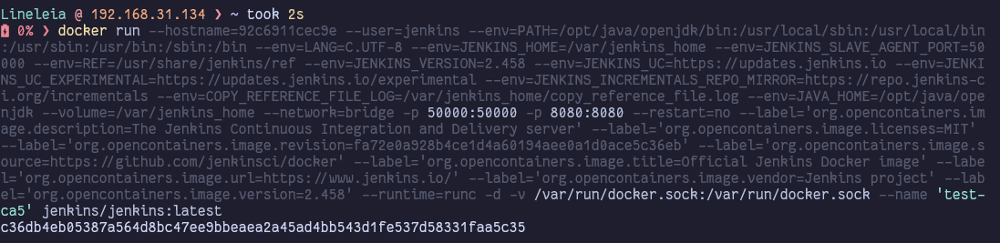

2. **Managing Docker Permissions:**
    - Execute commands within the Docker container using `docker exec`. The command below
      opens a bash shell in the container as the root user.
      ```bash
      docker exec -u root -t -i CONTAINER_NAME /bin/bash
      ```

    - **Recommended Approach: Adding Jenkins to the Docker Group**
        - The recommended approach to managing Docker permissions involves
          adding `jenkins` to the Docker group.
        - 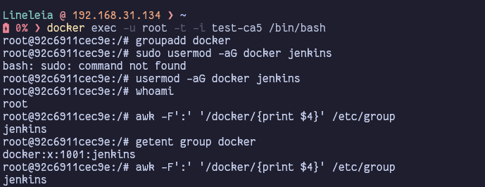

    - **Alternative Approach: Using `chmod` (Not Recommended)**
        - If adding `jenkins` to the Docker group doesn't work, you can run the commands
          below. Please consider the security risks before trying this approach.
        - 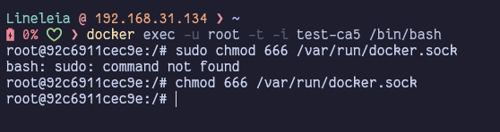

### Results

Once Jenkins has the necessary permissions to access the Docker daemon, the rest of the
process should proceed smoothly. The provided images show the successful build and push of
my Docker image to Docker Hub, as well as the successful rendering of the Javadoc and Test
components.

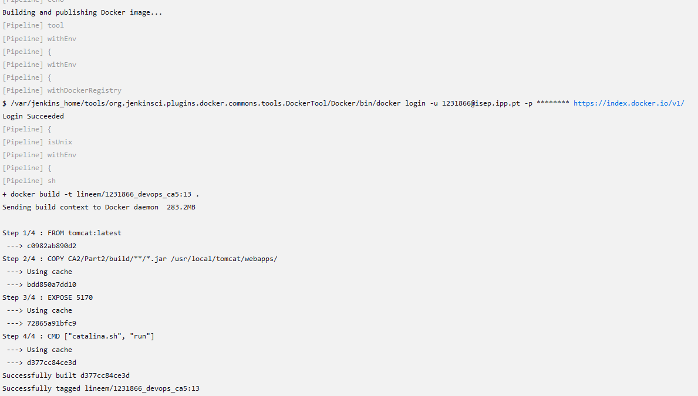

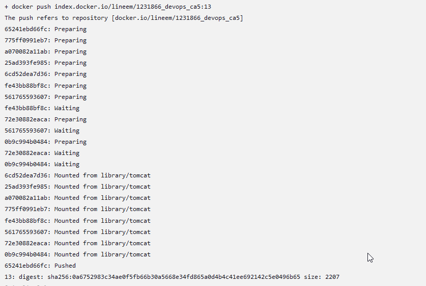

It ran successfully, with both the Javadoc and Test components rendering well:

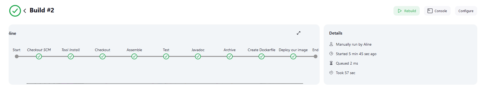

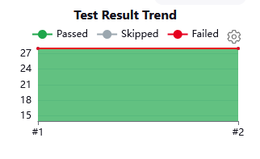

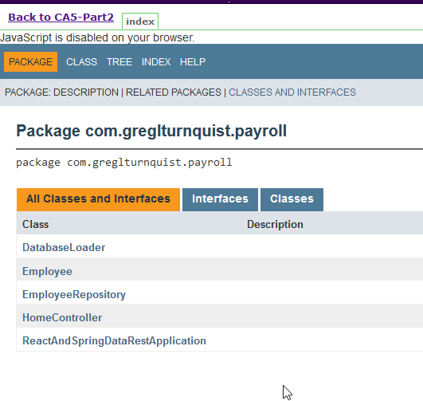

We can also check Docker Hub, and run our image.

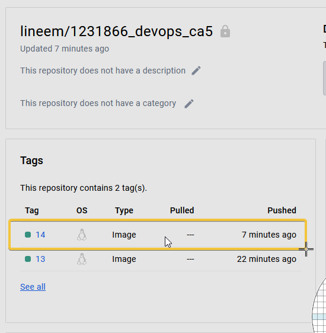

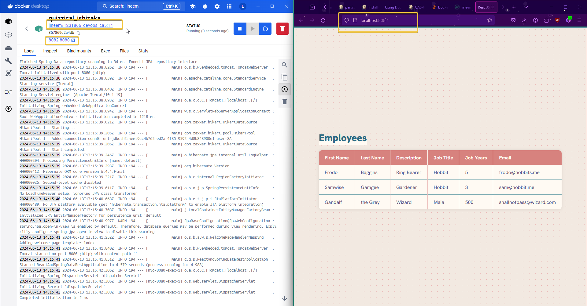

# Conclusion

Throughout this project, I've gained a deeper understanding of Jenkins and its capabilities. I've learned how to automate various stages of a Gradle project, including
build, test, archive, and others. I've also learned how to work with plugins like
publishHTML, Javadoc, and Docker related plugins.

I've encountered challenges along the way, such as setting up Docker and dealing with
permissions. However, these challenges are part of the journey, and I believe I understand
more about this whole process.

I look forward to applying the skills and knowledge I've gained in future projects!

# Author

- [Aline Emily](https://github.com/line-em), 1231866
- Repository: https://github.com/line-em/devops-23-24-JPE-1231866/