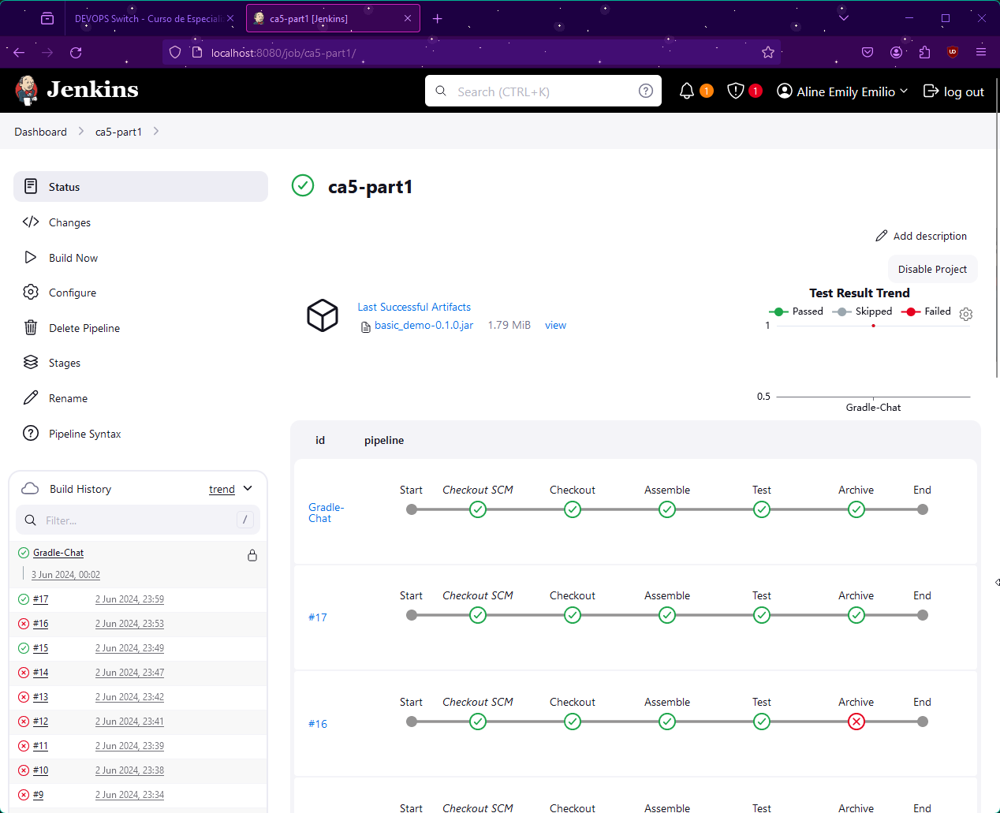

# Technical Report CA5: Jenkins Project

<!-- TOC -->

- [Technical Report CA5: Jenkins Project](#technical-report-ca5-jenkins-project)
  - [Introduction](#introduction)
  - [Prerequisites](#prerequisites)
  - [CA5 Part 1](#ca5-part-1)
    - [The Jenkinsfile](#the-jenkinsfile)
    - [Setting Up the Jenkins Pipeline](#setting-up-the-jenkins-pipeline)
    - [Configuring the Pipeline](#configuring-the-pipeline)
    - [Result](#result)
  - [CA5 Part 2](#ca5-part-2)
    - [The Jenkinsfile](#the-jenkinsfile-1)
    - [Docker Setup](#docker-setup)
    - [Docker Permissions](#docker-permissions)
    - [Results](#results)
    - [Docker Hub](#docker-hub)
- [Conclusion](#conclusion)
- [Author](#author)

<!-- TOC -->

## Introduction

The Jenkins pipeline scripts created in this CA are designed to automate the build, test, archive and others stages of a Gradle project located in the `CA2/Part1/gradle_basic_demo` and `CA2/Part2` directories.

This will allow us to understand how Jenkins works, and the various ways it can automate our projects, saving us a lot of effort and time.

## Prerequisites

To follow this tutorial, you need to have **Jenkins** installed and properly configured.
This includes setting up the necessary Jenkins plugins - in this case, **publishHTML and Docker related plugins**.

You can install Jenkins on Docker, using the following image:


You might also need to configure Jenkins authentication if it's your first time using it.
You can follow the instructions on the `docker logs`


Then you can complete the installation, installing all the recommended plugins.

Afterwards, go to "Manage Jenkins" -> "Manage Plugins" -> "Available" and search for the plugins mentioned before (Docker Pipeline and publishHTML). Here's how they look like:


Now we have everything setup for the next steps!

## CA5 Part 1

The first part of the CA5 is to practice with our project Gradle Basic Demo. So that's what we're going to do!

Our Jenkinsfile for this project should include the following tasks: **Checkout, Assemble, Test and Archive**. Please remember that it follows the **groovy** language and syntax. Here's what mine looks like:

### The Jenkinsfile

```groovy
pipeline {
    stages {
        stage('Checkout') {
            steps {
                echo 'Checking Out...'
                script {
                    git branch: 'main',
                            url: 'https://github.com/line-em/devops-23-24-JPE-1231866.git'
                }
            }
        }
        stage('Assemble') {
            steps {
                dir('./CA2/Part1/gradle_basic_demo') {
                    echo 'Assembling...'
                    sh './gradlew assemble'
                }
            }
        }
        stage('Test') {
            steps {
                dir('./CA2/Part1/gradle_basic_demo') {
                    echo 'Testing...'
                    sh './gradlew test'
                }
            }
            post {
                always {
                    junit '**/build/test-results/**/*.xml'
                }
            }
        }
        stage('Archive') {
            steps {
                echo 'Archiving...'
                archiveArtifacts artifacts: 'CA2/Part1/gradle_basic_demo/build/**/*.jar', onlyIfSuccessful: true
            }
        }
    }
}
```

Before proceeding, ensure all directories are correctly set up to avoid potential issues. Note that this guide assumes the repository is public. For private repositories, additional steps to include credentials may be necessary.

### Setting Up the Jenkins Pipeline

1. Navigate to your Jenkins **Dashboard**.
2. Select **New Item > Pipeline** and assign a name of your choice. For this guide, the pipeline is named `ca5_part1`.

### Configuring the Pipeline

To configure Jenkins to correctly find and execute our pipeline script, follow these steps:

1. Click on **Configure**, then navigate to the **Pipeline** section.
2. For the **Definition**, select **Pipeline script from SCM**.
3. Set **SCM** to **Git**.
4. Enter your repository URL. Add credentials if your repository is private.
5. Specify the branch to build from, such as `origin/main`.
   
6. Enter the path to your Jenkinsfile, e.g., `CA5/Part1/Jenkinsfile`.
7. If you encounter any issues, consider disabling **Lightweight Checkout** (this option is unchecked in this guide).

Adjust these steps as necessary to fit your project's specific requirements and configurations. Jenkins provides intuitive feedback for troubleshooting failed tasks, making it easier to identify and resolve issues!


### Result

Upon a successful pipeline execution, you'll be greeted with a fully green pipeline, indicating success:




Mastering this may take some time and practice—it certainly did for me! The key is to ensure every step has executed correctly. Verify the tests have passed, the archive is complete, etc. Here's an example of successful test results:


Now we're ready for the second part for this assignment!

## CA5 Part 2

For the second part, we need to create a new Jenkinsfile for our CA2/Part2 project. We will have the following stages: **Checkout, Assemble, Test, Javadoc, publishHTML, Archive, and Create / Publish Docker Image**, in order to generate a docker image and push it to Docker Hub.

First, make sure you have the following plugins installed - **publishHTML and Docker Pipeline** (and its dependencies, like Docker Commons)


With that settled, we can write our Jenkinsfile.

### The Jenkinsfile

```groovy
/* groovylint-disable CompileStatic */
pipeline {
    agent any
    environment {
        DOCKER_CREDENTIALS_ID = 'DOCKER_1231866'
        DOCKER_IMAGE = 'lineem/1231866_devops_ca5'
        DOCKER_TAG = "${env.BUILD_ID}"
    }
    tools {
        'org.jenkinsci.plugins.docker.commons.tools.DockerTool' 'Docker'
    }
    stages {
        stage('Checkout') {
            steps {
                echo 'Checking Out...'
                script {
                    git branch: 'main',
                            url: 'https://github.com/line-em/devops-23-24-JPE-1231866.git'
                }
            }
        }
        stage('Assemble') {
            steps {
                dir('./CA2/Part2') {
                    echo 'Assembling...'
                    sh './gradlew assemble'
                }
            }
        }
        stage('Test') {
            steps {
                dir('./CA2/Part2') {
                    echo 'Testing...'
                    sh './gradlew test'
                }
            }
            post {
                always {
                    junit '**/build/test-results/**/*.xml'
                }
            }
        }
        stage('Javadoc') {
            steps {
                dir('./CA2/Part2') {
                    echo 'Generating Javadoc...'
                    sh './gradlew javadoc'
                }
            }
            post {
                always {
                    publishHTML([
                            allowMissing          : false,
                            alwaysLinkToLastBuild : false,
                            keepAll               : false,
                            reportDir             : './CA2/Part2/build/docs/javadoc',
                            reportFiles           : 'index.html',
                            reportName            : 'Javadoc',
                            reportTitles          : '',
                            useWrapperFileDirectly: true
                    ])
                }
            }
        }
        stage('Archive') {
            steps {
                echo 'Archiving...'
                archiveArtifacts artifacts: 'CA2/Part2/build/**/*.jar', onlyIfSuccessful: true
            }
        }
        stage('Create Dockerfile') {
            steps {
                script {
                    echo 'Creating Dockerfile...'
                    writeFile file: 'Dockerfile', text: """
                    FROM gradle:jdk21 as builder

                    WORKDIR /CA5/
                    RUN git clone https://github.com/line-em/devops-23-24-JPE-1231866.git

                    WORKDIR /CA5/devops-23-24-JPE-1231866/CA2/Part2
                    RUN gradle build
                    EXPOSE 8082

                    COPY *.jar /CA5/

                    CMD [ "gradle", "bootRun" ]
                    """
                }
            }
        }
        stage('Deploy our image') {
            steps {
                script {
                    echo 'Building and publishing Docker image...'
                    docker.withTool('Docker') {
                        docker.withRegistry('https://index.docker.io/v1/', DOCKER_CREDENTIALS_ID) {
                            def customImage = docker.build("${DOCKER_IMAGE}:${DOCKER_TAG}")
                            customImage.push()
                        }
                    }
                }
            }
        }
    }
}
```

At this point, you're ready to create and configure your Pipeline, similar to what we did in the previous section.

### Docker Setup

Setting up Docker with Jenkins can be a bit challenging. Here are some steps that might assist you in this process:

1. **Generate and Import Credentials:**
    - Generate your Docker credentials in Jenkins.
    - Import these credentials in your `Jenkinsfile`. Define the
      variable `DOCKER_CREDENTIALS_ID` and use it with the `docker.withRegistry()`
      function.

2. **Set Up Your Docker Tool:**
    - On Jenkins, navigate to **Dashboard > Manage Jenkins > Global Tool Configuration**.
    - Set up Docker. You can choose a automatic installer for simplicity.

3. **Manually Invoke the Docker Tool in Your `Jenkinsfile`:**
    - This step helps avoid potential I/O exceptions. You can define the tool at the
      beginning of your `Jenkinsfile` as suggested in the Docker Commons plugin
      documentation. This method was helpful in my case.
    - Define the Docker tool as follows:
      ```groovy
      tools {
      'org.jenkinsci.plugins.docker.commons.tools.DockerTool' 'Docker'
      }
      ```

4. **Use the Docker Tool to Wrap Docker Functions:**
    - Use the defined Docker tool to wrap your Docker functions in the `Jenkinsfile`:
      ```groovy
      docker.withTool('Docker') {
          docker.withRegistry('https://index.docker.io/v1/', DOCKER_CREDENTIALS_ID) {
              def customImage = docker.build("${DOCKER_IMAGE}:${DOCKER_TAG}")
              customImage.push()
          }
      }
      ```

### Docker Permissions

At this point in the project, Docker should be correctly configured. However, it's important to note that the `Jenkinsfile` may not function as expected due to common permission issues. I was able to resolve these issues by manually managing Docker permissions with `chmod`, but this approach is not recommended due to potential security
risks!

I'll outline two approaches to managing Docker permissions below, with a strong
recommendation to try the user group method first.

1. **Mounting the Docker Socket:**
    - Ensure that you run your Docker container with
      the `-v /var/run/docker.sock:/var/run/docker.sock` attribute. This command mounts
      the Docker socket from the host into the container, allowing the container to
      communicate with the Docker daemon on the host.
    - This solution is recommended for Linux machines and might work without additional
      configuration. This solution was
      recommended [here](https://jpetazzo.github.io/2015/09/03/do-not-use-docker-in-docker-for-ci/).

   If you're using Docker Desktop, you can append this attribute to your existing Docker
   commands, as shown below:
   

2. **Managing Docker Permissions:**
    - Execute commands within the Docker container using `docker exec`. The command below
      opens a bash shell in the container as the root user.
      ```bash
      docker exec -u root -t -i CONTAINER_NAME /bin/bash
      ```

    - **Recommended Approach: Adding Jenkins to the Docker Group**
        - The recommended approach to managing Docker permissions involves
          adding `jenkins` to the Docker group.
        - 

    - **Alternative Approach: Using `chmod` (Not Recommended)**
        - If adding `jenkins` to the Docker group doesn't work, you can run the commands
          below. Please consider the security risks before trying this approach.
        - 

### Results

Once Jenkins has the necessary permissions to access the Docker daemon, the rest of the
process should proceed smoothly. The provided images show the successful build and push of
my Docker image to Docker Hub, as well as the successful rendering of the Javadoc and Test
components.


It ran successfully, with both the Javadoc and Test components rendering well, which can be seen in different parts of the Jenkins interface!

**Pipeline Overview:**


**Test Results:**


**Javadocs:**


You can check all of these to make sure it ran properly.

PS: You can try to build your Dockerfile in the way that suits your projects necessities best. For instance, I also tried running my old image from CA4/Part2, like this, and it also worked as expected!

```groovy
stage('Create Dockerfile') {
    steps {
        script {
            echo 'Creating Dockerfile...'
            writeFile file: 'Dockerfile', text: """
            FROM lineem/1231866_devops:ca4_part2_web
            LABEL author="Aline Emily"
            CMD [ "gradle", "bootRun" ]
                    """
        }
    }
}
```

### Docker Hub

We can also check Docker Hub, and run our image locally to verify the results.


The DockerHub link is here: [https://hub.docker.com/repository/docker/lineem/1231866_devops_ca5/general](https://hub.docker.com/repository/docker/lineem/1231866_devops_ca5/general)

# Conclusion

Throughout this project, I've gained a deeper understanding of Jenkins and its capabilities. I've learned how to automate various stages of a Gradle project, including
build, test, archive, and others. I've also learned how to work with plugins like
publishHTML, Javadoc, and Docker related plugins.

I've encountered challenges along the way, such as setting up Docker and dealing with
permissions. However, these challenges are part of the journey, and I believe I understand
more about this whole process.

I look forward to applying the skills and knowledge I've gained in future projects!

# Author

- [Aline Emily](https://github.com/line-em), 1231866
- **Repository**: https://github.com/line-em/devops-23-24-JPE-1231866/